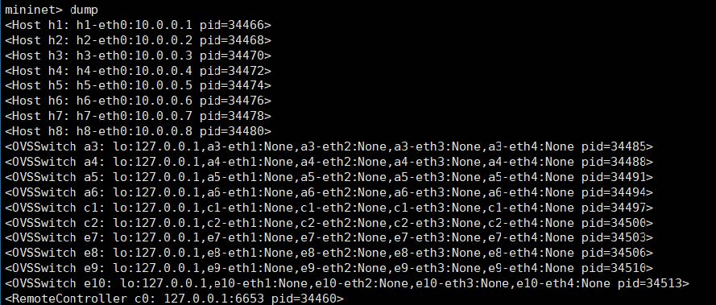

## Create Custom DC Topology
1.  Start Controller
    ```
    root@server03:~/ryu/ryu/app# ryu-manager simple_switch_stp_13.py
    ```
2.  Establish Topology
    *  Start in Mininet
    ```
    root@server03:~/mininet/custom# sudo mn --custom ./dc_topo.py --topo=mytopo --controller=remote
    ```
    *  Start in Distrinet
    ```
    root@server03:~/mininet/custom# sudo dmn --custom ./dc_topo.py --topo=mytopo --controller=remote
    ``` 
## Simple Performance Test
#### Test In Mininet
1. Pingall Test
    
2. Topo Check
    
    
3. End to end bandwidth test
    
#### Test In Distrinet