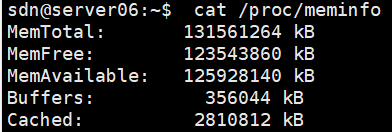
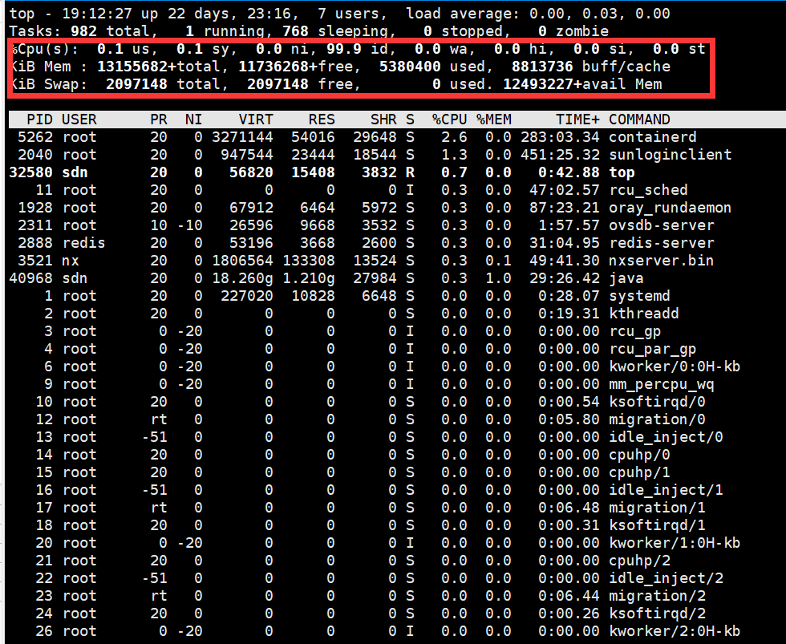
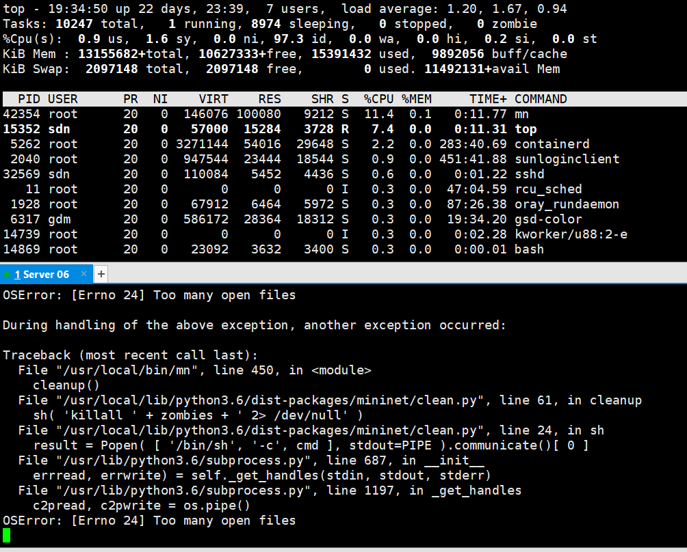
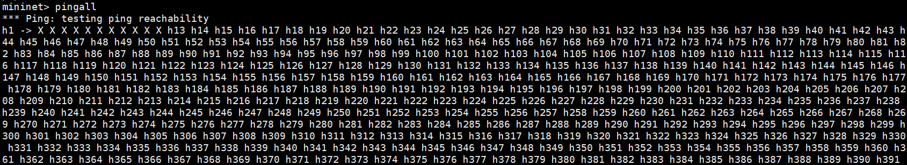
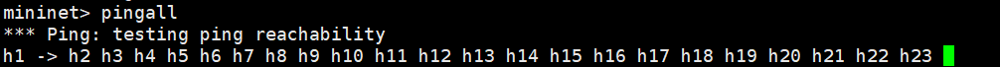
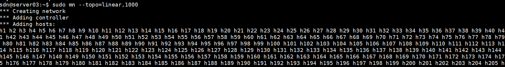
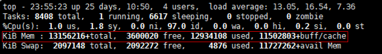

## Create Custom DC Topology
####   Basic computer configuration
1.  CPU：Intel(R) Xeon(R) Gold 6252 CPU @ 2.10GHz *48
    
    
    
2. Mem：
   
    
    
    
####  Establish Topology In Mininet
1.  The original situation of the server
    
    
    
    
    
2. Establish in Single Topology(one switch):OSError: [Errno 24] Too many open files.Memory Limit
    ```
    sdn@server03:~$ sudo mn --topo=single,10000
    ```
     
    
    ```
    sdn@server03:~$ sudo mn --topo=single,1500
    mininet> pingall
    ```
    
    
    
3. Establish in linear Topology(There are probably more that can be started, but the upper limit is this order of magnitude,5000 hosts)

    ```
    sdn@server03:~$ sudo mn --topo=linear,2500,2
    ```

    

    

    

4. Establish in Tree Topology. 343 vswitches and 5832 vhosts.

    ```
    sdn@server03:~$ sudo mn --topo=tree,depth=3,fanout=18
    ```

    

    

