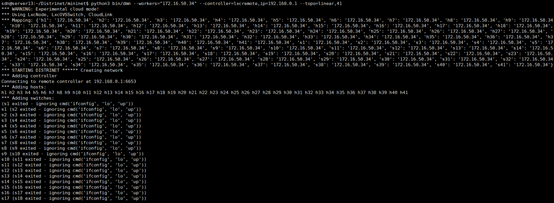
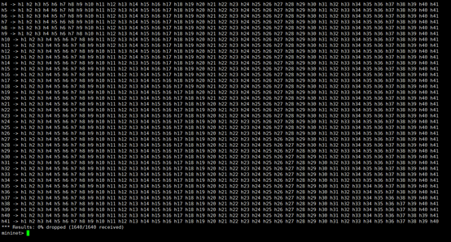
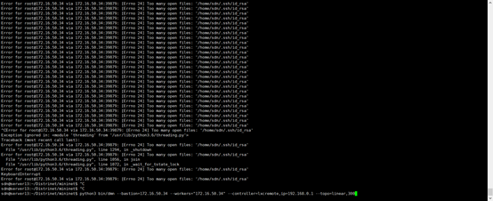
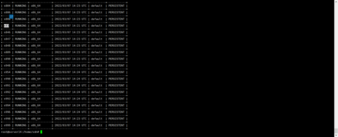

## Test environment:
# Ubuntu 18.0.4 
# 22 core 44 thread server

### The limit test of the number of nodes can be started by distrinet
#   Topology type: linear
#   Successfully started pingall with zero packet loss. The maximum number of nodes is 82 (41host + 41switch)
#  (the topology is linear, 41)
1. start in distrinet
    

2. pingall
   

3. Further increase the number of nodes [errno 24] too many open files: '/ home / SDN / ssh/id_ "RSA" will appear
   

## We speculate these performances are related to the limit of LXD containers that the system can run at the same time
### The limit test of the number of lxd containers running 
# Between 250 and 300
1. 
  

## To sum up, due to the problems of the code itself and LXD's heavy weight, the performance of distrinet is still far from the goal. Adjustments need to be made (e.g. switching to docker)

