[toc]

# Introduction

This file shows comparisons between Distrinet and Distrinet after docker replacement, which we call as "docker". We compare these two tools from 3 aspects, performance, scale and time.

# Performance Comparison

We tested the performances of these examples: a linear topology with 6 hosts and 6 switches; a binary tree whose depth is 3; customized topology.

We care about these metrics: the connection of the topology and the bandwidth of iperf.

"Pingall and links" are metrics to test the connection of the topology.

"Worker containers" part shows lxd/docker containers created in worker host.

"Iperf" is used to test the bandwidth.

## Linear topology (6 hosts,6 switches)

There are 6 hosts and 6 switches in the topology.

### lxd container

- pingall

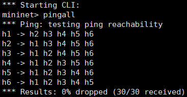

- links

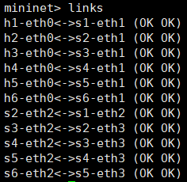

- worker containers

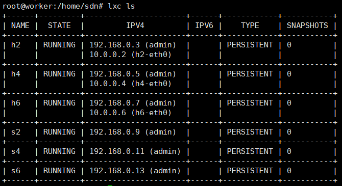

- iperf

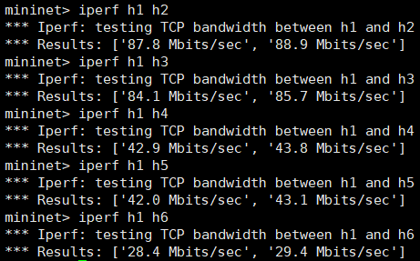

### docker container

- pingall

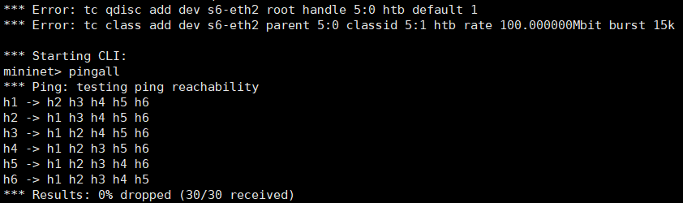

- links

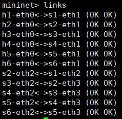

- worker containers

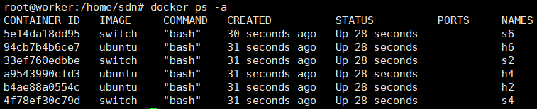

- iperf

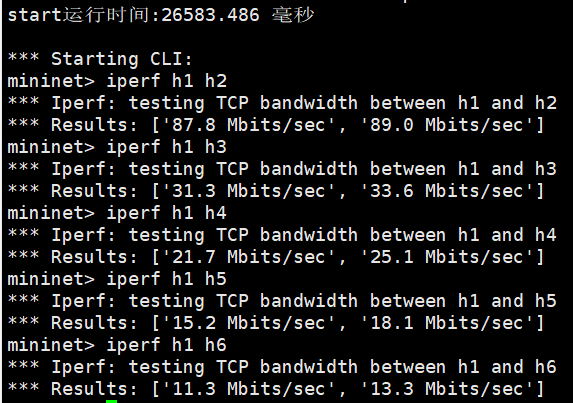

## Binary tree (depth = 3)

There are 8 hosts and 7 switches in the tree topology.

### lxd container

- pingall

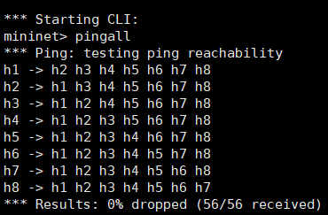

- links & net

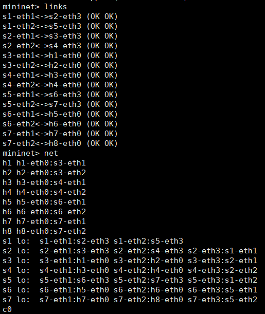

- worker containers

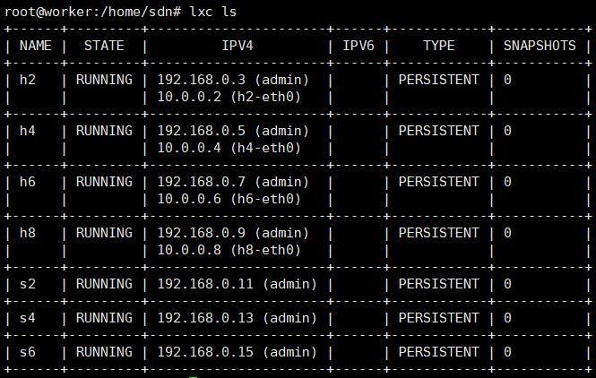

- iperf

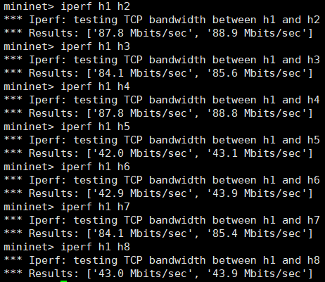

### docker container

- pingall

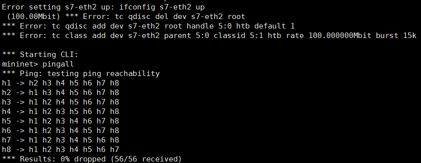

- links & net

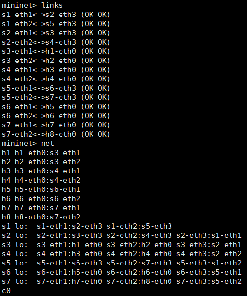

- worker containers

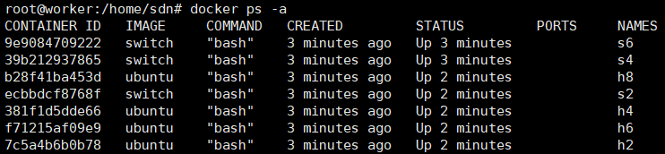

- iperf

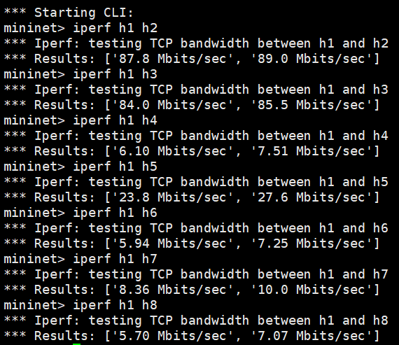

## Customized topology

### Illustrstion

There are 8 hosts and 10 switches in the customized topology.

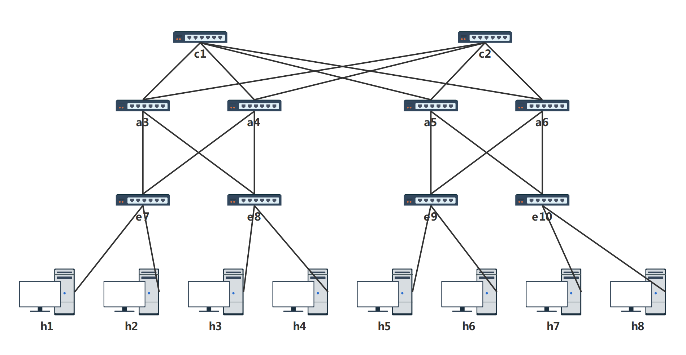

### lxd container

- pingall

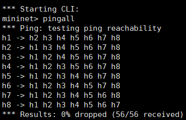

- links & net

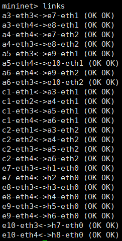

- worker containers

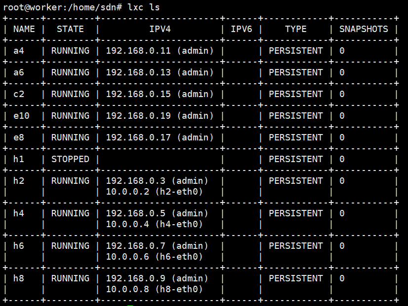

- iperf

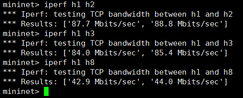

### docker container

- pingall

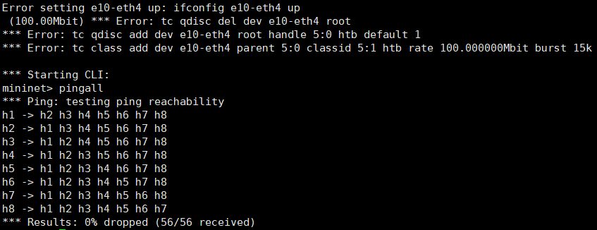

- links & net

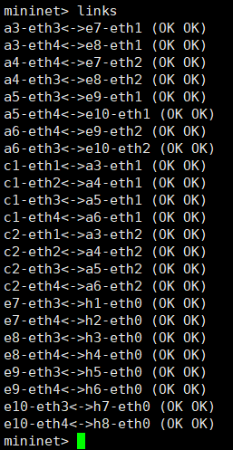

- worker containers

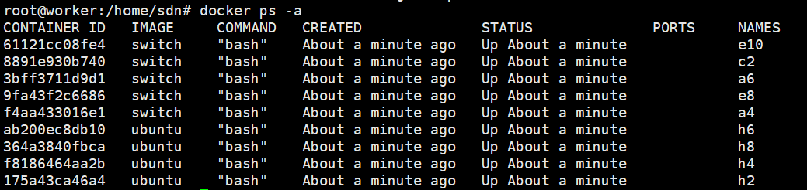

- iperf

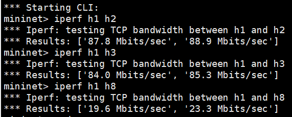

# Scale Comparison

We test **the maximum scale of linear topology** that two tools can support. It shows that after the docker replacement, we can establish much larger scale than before.

## lxd container: between 90 and 99

90 hosts and 90 switches can be established.

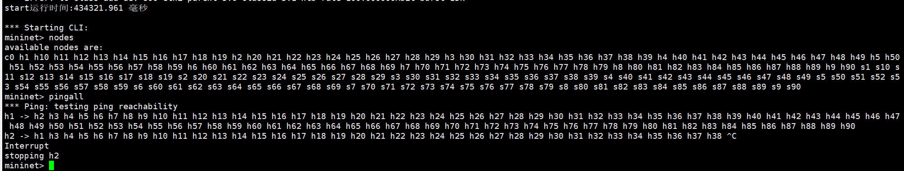

However, when establishing 99 hosts and 99 switches, this error occurred.

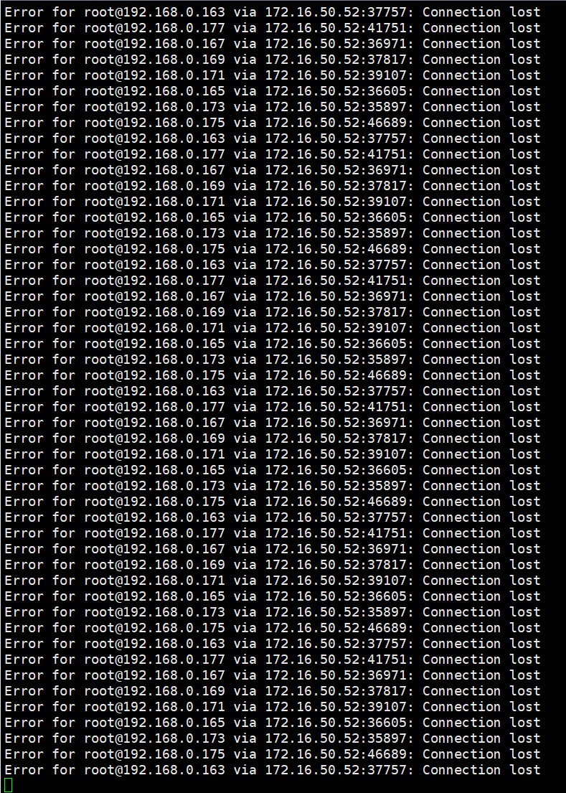

## docker container: at least 400

300 hosts and 300 switches can be established.

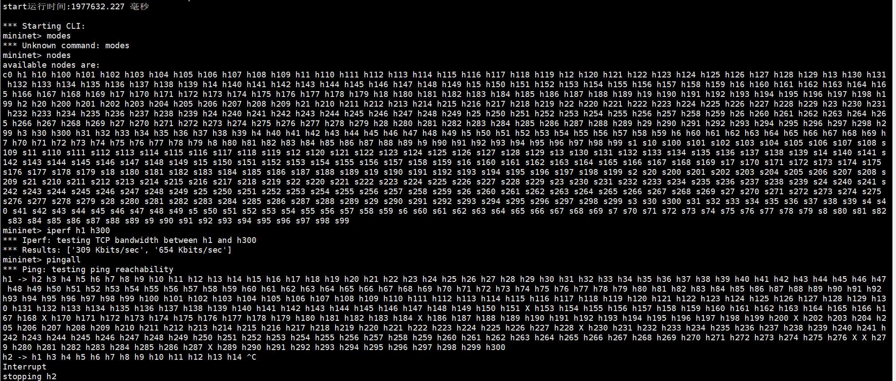

400 hosts and 400 switches can be established.However, some packages are lost.

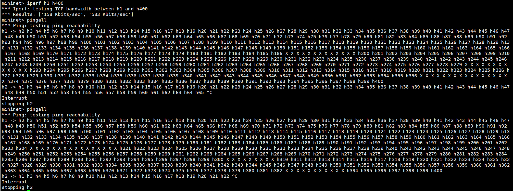

# Time Comparison

Otherwise, we added a new module to test the time to establish and stop the topology. And we noticed that after the docker replacement, time performance is better.

We show average start/stop time in the chart below.

| topology type              | lxd start time(ms) | docker start time(ms) | lxd stop time(ms) | docker stop time(ms) |
| -------------------------- | ------------------ | --------------------- | ----------------- | -------------------- |
| linear_10                  | 43283.724          | 39618.796             | 17412.770         | 14586.549            |
| linear_20                  | 85042.979          | 74643.517             | 29419.694         | 29851.002            |
| linear_30                  | 145570.518         | 116308.483            | 51053.180         | 49878.966            |
| linear_40                  | 189553.188         | 150765.474            | 73760.429         | 71019.690            |
| full_tree_depth=2_degree=2 | 21257.863          | 17055.762             | 9104.821          | 6914.141             |
| full_tree_depth=2_degree=3 | 30518.782          | 29184.385             | 13705.951         | 13014.671            |
| full_tree_depth=3_degree=2 | 33082.372          | 31833.954             | 14239.144         | 11628.452            |
| full_tree_depth=3_degree=3 | 81417.790          | 75521.407             | 28824.049         | 29416.155            |
| custom                     | 46788.506          | 45623.731             | 22290.356         | 18247.342            |
